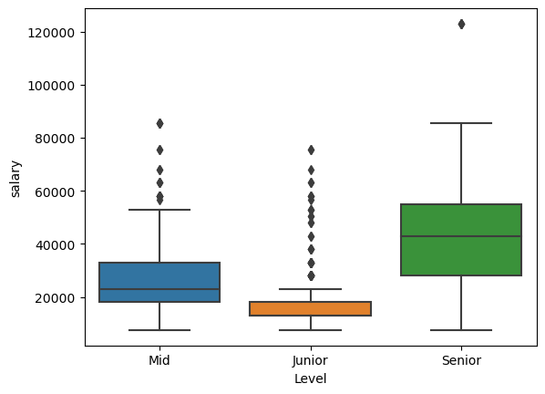

<h1 align="center">💵Turkish Developer 2023 Salary Data Analysis💵</h1>

---

<h2> Data </h2>

See more dataset info: [SalaryData](https://www.kaggle.com/datasets/fatihsen20/developer-salary)

---

<h2> Demo </h2>

### Maaşların seviyelere göre kutu grafiği yukarıda gösterilmiştir. **Junior** seviye maaşları verilere göre ortalama **17000 TL**, **Mid** seviye maaşları verilere göre ortalama **27500 TL** ve **Senior** seviye maaşları ise ortalama **43700 TL**. Maaşların dağılımı yurtdışı ve yurtiçi karışık olarak verilmiş. Bu yüzden yurtiçi ve yurtdışı maaşlarını ayrı ayrı incelemek daha doğru olacaktır.

---
